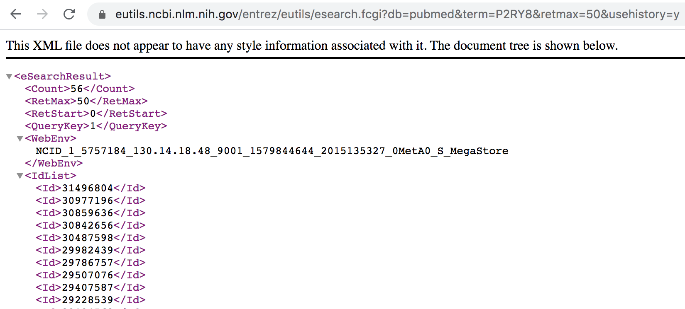
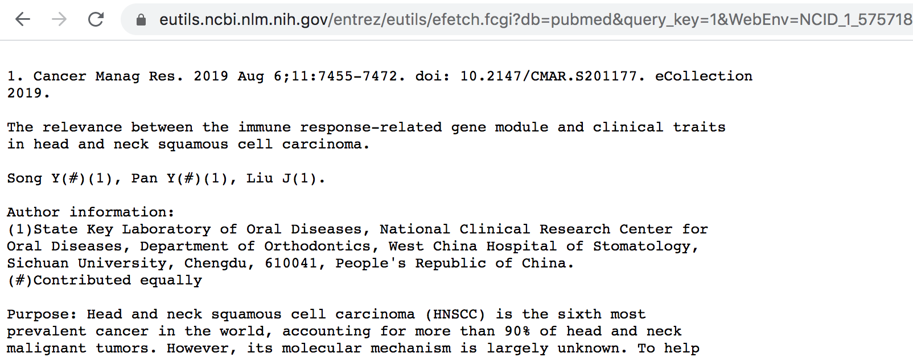

# Extracting Pubmed abstracts by scripting NCBI E-utilities in Python

Erick Lu

March 6, 2020

* [Introduction](#Introduction)
* [How the NCBI E-utilities work](#How-the-NCBI-E-utilities-work)
* [Using the E-utilities in Python](#Using-the-E-utilities-in-Python)
* [Writing a loop to fetch all abstracts](#Writing-a-loop-to-fetch-all-abstracts)
* [Conclusion](#Conclusion)

Here, I will show you how NCBI E-Utilities can be used to search for and download Pubmed abstracts. I use Python in conjunction with the NCBI E-Utilities to download all the abstracts corresponding to a given search term and simultaneously parse the information contained in each abstract into a data science-friendly format.

## Introduction

Depending on what you search for in PubMed, you could be presented with thousands of abstracts that contain the keyword you used for your query (for example, try searching "cancer"). Finding the information you’re looking for can get a bit tedious when you have to manually click through each page of search results.

Using the NCBI E-Utilities (Entrez Programming Utilities, https://www.ncbi.nlm.nih.gov/books/NBK25499/), you can retrieve and download abstracts associated with a PubMed search without having to sift through the user interface. Even better, this tool doesn’t require any software–its completely URL based. You craft "search" and "fetch" commands as URLs and open them in your browser window to access the abstracts.

We can automate the download process by programming a script in Python to construct the URLs, execute the "search" and "fetch" commands, and parse each part of the abstract (Authors, Journal, Date of publication, etc.) into a data file for downstream analysis. Text from each abstract can be analyzed to quickly extract numerical data or quantitative results.

Below, I will give a brief tutorial about how the tools work, and the code needed to automate the process using Python.


## How the NCBI E-utilities work

The two main E-util functions you will use are ```esearch``` and ```efetch```.

First, ```esearch``` runs a keyword search command on the PubMed database and retrieves IDs for each of the abstracts corresponding to the search. The actual information associated with the abstracts does not show up, only the IDs. You’re also given a ```query key``` and ```web environment ID```. 

Then, you input the ```query key``` and ```web environment ID``` into an ```efetch``` call, which will “fetch” all the abstracts for that specific ```esearch``` query.

Let’s say I want to search pubmed for "P2RY8", which is a receptor on B lymphocytes that I worked on during my PhD.

### Step 1. Craft your esearch URL

Here is the URL required to execute a PubMed esearch for P2RY8:
http://eutils.ncbi.nlm.nih.gov/entrez/eutils/esearch.fcgi?db=pubmed&term=P2RY8&retmax=50&usehistory=y

This was crafted by putting the following parameters together:
* ```http://eutils.ncbi.nlm.nih.gov/entrez/eutils/esearch.fcgi?``` is the backbone of the esearch function.
* ```db=pubmed``` specifies that we will be searching the pubmed database. 
* ```term=P2RY8``` specifies what we will be searching pubmed for. Change this field to whatever you want to search for.
* ```retmax=50``` specifies how many abstracts I want to return using the search.
* ```usehistory=y``` will provide you with a QueryKey and WebEnv id that will let you fetch abstracts from this search.
* The “&” signs are just used to separate the different conditions. Make sure to include it starting from after the ```db=pubmed``` argument.

Copying and pasting the full URL into my web browser results in a webpage that looks like this (XML output):



### Step 2. Craft the efetch URL

The next step is to execute an efetch command by constructing a new URL. Using the webenv and querykey information given in the above esearch result, I will type the following efetch command into my browser:

https://eutils.ncbi.nlm.nih.gov/entrez/eutils/efetch.fcgi?db=pubmed&query_key=1&WebEnv=NCID_1_5757184_130.14.18.48_9001_1579844644_2015135327_0MetA0_S_MegaStore&retstart=0&retmax=50&retmode=text&rettype=abstract

Note: If you’re trying this right now, your esearch will have given you a different webenv variable. Make sure to input YOUR webenv variable in the efetch URL for it to work!

Here is an explanation for each aspect of the link I constructed above:
* ```http://eutils.ncbi.nlm.nih.gov/entrez/eutils/efetch.fcgi?``` is the backbone for a efetch command. Notice that the only difference from this and an esearch command is the part after “/eutils/”.
* ```db=pubmed``` specifies the database, again.
* ```query_key=1``` specifies the number that was given in the “querykey” field in the esearch result.
* ```webenv=NCID_1_5757184_130.14.18.48_9001_1579844644_2015135327_0MetA0_S_MegaStore``` specifies the ID that was given in the esearch result. 
* ```retmode=text``` specifies that I want the abstracts to be written out in print. 
* ```rettype=abstract``` specifies that I want abstracts shown, as opposed to other types of info that can be given from a PubMed search.

After inputting this link, you should observe the following output as a plaintext webpage:



Now, I can simply ctrl-F to sift through over three hundred abstracts. You can apply this simple two-step process whenever you’re tasked with searching through absurd amounts of Pubmed results.

Below, I show you how to perform this process in Python.

## Using the E-utilities in Python

The packages we need include `csv` to write to a csv file, `re` in order to use regular expressions to extract information from `esearch` results, `urllib` to open and read urls, and `time` in order to sleep for a couple seconds between requests so we don't get blocked.


```python
import csv
import re
import urllib
from time import sleep
```

Now, we need to specify our parameters for the `esearch` and `efetch` calls. We can store each of the settings in their own individual variables in order to make it easy to customize the calls in the future.


```python
query = 'P2RY8'

# common settings between esearch and efetch
base_url = 'http://eutils.ncbi.nlm.nih.gov/entrez/eutils/'
db = 'db=pubmed'

# esearch specific settings
search_eutil = 'esearch.fcgi?'
search_term = '&term=' + query
search_usehistory = '&usehistory=y'
search_rettype = '&rettype=json'
```

We can construct the search url by simply combining together each of the variables into a long string:


```python
search_url = base_url+search_eutil+db+search_term+search_usehistory+search_rettype
print(search_url)
```

    http://eutils.ncbi.nlm.nih.gov/entrez/eutils/esearch.fcgi?db=pubmed&term=P2RY8&usehistory=y&rettype=json


Now that we have the full `esearch` url constructed, we can open the url using `urllib.request.urlopen()`:


```python
f = urllib.request.urlopen(search_url)
search_data = f.read().decode('utf-8')
```


```python
search_data
```


    '<?xml version="1.0" encoding="UTF-8" ?>\n<!DOCTYPE eSearchResult PUBLIC "-//NLM//DTD esearch 20060628//EN" "https://eutils.ncbi.nlm.nih.gov/eutils/dtd/20060628/esearch.dtd">\n<eSearchResult><Count>56</Count><RetMax>20</RetMax><RetStart>0</RetStart><QueryKey>1</QueryKey><WebEnv>NCID_1_115314692_130.14.18.97_9001_1583534241_328526540_0MetA0_S_MegaStore</WebEnv><IdList>\n<Id>31496804</Id>\n<Id>30977196</Id>\n<Id>30859636</Id>\n<Id>30842656</Id>\n<Id>30487598</Id>\n<Id>29982439</Id>\n<Id>29786757</Id>\n<Id>29507076</Id>\n<Id>29407587</Id>\n<Id>29228539</Id>\n<Id>29194562</Id>\n<Id>29140408</Id>\n<Id>28866095</Id>\n<Id>28597942</Id>\n<Id>28408464</Id>\n<Id>28395118</Id>\n<Id>28371317</Id>\n<Id>28033648</Id>\n<Id>27959929</Id>\n<Id>27899802</Id>\n</IdList><TranslationSet/><TranslationStack>   <TermSet>    <Term>P2RY8[All Fields]</Term>    <Field>All Fields</Field>    <Count>56</Count>    <Explode>N</Explode>   </TermSet>   <OP>GROUP</OP>  </TranslationStack><QueryTranslation>P2RY8[All Fields]</QueryTranslation></eSearchResult>\n'


Above, you can compare the raw text output of the esearch result with the image of what it looks like in the browser. You can see that the same syntax is used for the `WebEnv` and `QueryKey` sections. We will also need the total number of abstracts corresponding to the query, if we want to be able to retrieve all the abstracts. We can extract these items from the output using the regexes below:


```python
# obtain total abstract count
total_abstract_count = int(re.findall("<Count>(\d+?)</Count>",search_data)[0])

# obtain webenv and querykey settings for efetch command
fetch_webenv = "&WebEnv=" + re.findall ("<WebEnv>(\S+)<\/WebEnv>", search_data)[0]
fetch_querykey = "&query_key=" + re.findall("<QueryKey>(\d+?)</QueryKey>",search_data)[0]
```


```python
total_abstract_count
```


    56


We observe that there are 56 total abstracts that match the keyword "P2RY8".


```python
fetch_webenv
```


    '&WebEnv=NCID_1_5579798_130.14.18.48_9001_1579842017_1501765481_0MetA0_S_MegaStore'


```python
fetch_querykey
```


    '&query_key=1'


Now that we have the `WebEnv` and `QueryKey`, we can run an `efetch` command to obtain the abstracts. In order to do so, we must assign values to each of the parameters in a similar manner as we did above for esearch.


```python
# other efetch settings
fetch_eutil = 'efetch.fcgi?'
retmax = 20
retstart = 0
fetch_retstart = "&retstart=" + str(retstart)
fetch_retmax = "&retmax=" + str(retmax)
fetch_retmode = "&retmode=text"
fetch_rettype = "&rettype=abstract"
```

The fully constructed efetch command using the above parameters, which should fetch 20 of the 56 total abstracts, is below:


```python
fetch_url = base_url+fetch_eutil+db+fetch_querykey+fetch_webenv+fetch_retstart+fetch_retmax+fetch_retmode+fetch_rettype
print(fetch_url)
```

    http://eutils.ncbi.nlm.nih.gov/entrez/eutils/efetch.fcgi?db=pubmed&query_key=1&WebEnv=NCID_1_115314692_130.14.18.97_9001_1583534241_328526540_0MetA0_S_MegaStore&retstart=0&retmax=20&retmode=text&rettype=abstract


Now, we can open the url the same way we did for esearch:


```python
f = urllib.request.urlopen (fetch_url)
fetch_data = f.read().decode('utf-8')
```


```python
fetch_data[1:3000]
```


    "1. Br J Haematol. 2012 Sep;158(6):772-7. doi: 10.1111/j.1365-2141.2012.09221.x. Epub\n2012 Jul 23.\n\nTreatment outcome of CRLF2-rearranged childhood acute lymphoblastic leukaemia: a \ncomparative analysis of the AIEOP-BFM and UK NCRI-CCLG study groups.\n\nAttarbaschi A(1), Morak M, Cario G, Cazzaniga G, Ensor HM, te Kronnie T, Bradtke \nJ, Mann G, Vendramini E, Palmi C, Schwab C, Russell LJ, Schrappe M, Conter V,\nMitchell CD, Strehl S, Zimmermann M, Pötschger U, Harrison CJ, Stanulla M,\nPanzer-Grümayer R, Haas OA, Moorman AV; Associazione Italiana di Ematologia ed\nOncologia Pediatrica (AIEOP)-Berlin-Frankfurt-Münster (BFM) Study Group and\nNational Cancer Research Institute (NCRI)-Children's Cancer and Leukaemia (CCLG) \nStudy Group.\n\nAuthor information: \n(1)Paediatric Haematology and Oncology, Department of Paediatrics, St. Anna\nChildren's Hospital, Medical University of Vienna, Vienna, Austria.\nandishe.attarbaschi@stanna.at\n\nThe prognostic relevance of CRLF2 -rearrangements in childhood acute B-cell\nprecursor lymphoblastic leukaemia (ALL), was assessed by a comparative analysis\nof 114 non-Down-syndrome patients (99 P2RY8-CRLF2+ , 15 IGH@-CRLF2+ ), 76 from\nthe AIEOP-BFM ALL 2000 and 38 from the MRC ALL97 trials. The 6-year cumulative\nrelapse incidence of P2RY8-CRLF2+ patients treated on the two trials was not\nstatistically different: 0·37 ± 0·06 vs. 0·25 ± 0·08 (P = 0·194). In contrast,\n0/9 IGH@-CRLF2+ AIEOP-BFM, but 5/6 ALL97 patients relapsed. Conclusively,\nP2RY8-CRLF2+ patients had an intermediate protocol-independent outcome while the \ndifferent prognosis of IGH@-CRLF2+ patients could be related to the different\nstructures of the applied treatment protocols.\n\n© 2012 Blackwell Publishing Ltd.\n\nDOI: 10.1111/j.1365-2141.2012.09221.x \nPMID: 22816614  [Indexed for MEDLINE]\n\n\n2. Leukemia. 2012 Oct;26(10):2245-53. doi: 10.1038/leu.2012.101. Epub 2012 Apr 9.\n\nPoor prognosis for P2RY8-CRLF2 fusion but not for CRLF2 over-expression in\nchildren with intermediate risk B-cell precursor acute lymphoblastic leukemia.\n\nPalmi C(1), Vendramini E, Silvestri D, Longinotti G, Frison D, Cario G, Shochat\nC, Stanulla M, Rossi V, Di Meglio AM, Villa T, Giarin E, Fazio G, Leszl A,\nSchrappe M, Basso G, Biondi A, Izraeli S, Conter V, Valsecchi MG, Cazzaniga G, Te\nKronnie G.\n\nAuthor information: \n(1)Centro Ricerca Tettamanti, Clinica Pediatrica, Università di Milano Bicocca,\nOspedale San Gerardo, Monza, Italy.\n\nPediatric B-cell precursor acute lymphoblastic leukemia (BCP-ALL) has achieved an\n80% cure rate as a result of a risk-adapted therapy largely based on minimal\nresidual disease (MRD) monitoring. However, relapse is still the most frequent\nadverse event, occurring mainly in the patients with intermediate MRD levels\n(intermediate risk, IR), emphasizing the need for new prognostic markers. We\nanalyzed the prognostic impact of cytokine receptor-like factor 2 (CRLF2)\nover-expression and P2RY8-CRLF2 fusion in 464 BCP-ALL patients (not affected by\nDown syndrome and BCR-ABL nega"


Examining the text output, we see that individual abstracts are separated by 3 new lines (```\n\n\n```). We can therefore use split() to generate a list in which each item is a separate abstract.


```python
# splits the data into individual abstracts
abstracts = fetch_data.split("\n\n\n")
len(abstracts)
```


    16


Because we had set `retmax = 20`, we obtained 20 abstracts. Let's take a closer look at an individual abstract:


```python
# print out the first abstract
abstracts[0]
```


    "\n1. Br J Haematol. 2012 Sep;158(6):772-7. doi: 10.1111/j.1365-2141.2012.09221.x. Epub\n2012 Jul 23.\n\nTreatment outcome of CRLF2-rearranged childhood acute lymphoblastic leukaemia: a \ncomparative analysis of the AIEOP-BFM and UK NCRI-CCLG study groups.\n\nAttarbaschi A(1), Morak M, Cario G, Cazzaniga G, Ensor HM, te Kronnie T, Bradtke \nJ, Mann G, Vendramini E, Palmi C, Schwab C, Russell LJ, Schrappe M, Conter V,\nMitchell CD, Strehl S, Zimmermann M, Pötschger U, Harrison CJ, Stanulla M,\nPanzer-Grümayer R, Haas OA, Moorman AV; Associazione Italiana di Ematologia ed\nOncologia Pediatrica (AIEOP)-Berlin-Frankfurt-Münster (BFM) Study Group and\nNational Cancer Research Institute (NCRI)-Children's Cancer and Leukaemia (CCLG) \nStudy Group.\n\nAuthor information: \n(1)Paediatric Haematology and Oncology, Department of Paediatrics, St. Anna\nChildren's Hospital, Medical University of Vienna, Vienna, Austria.\nandishe.attarbaschi@stanna.at\n\nThe prognostic relevance of CRLF2 -rearrangements in childhood acute B-cell\nprecursor lymphoblastic leukaemia (ALL), was assessed by a comparative analysis\nof 114 non-Down-syndrome patients (99 P2RY8-CRLF2+ , 15 IGH@-CRLF2+ ), 76 from\nthe AIEOP-BFM ALL 2000 and 38 from the MRC ALL97 trials. The 6-year cumulative\nrelapse incidence of P2RY8-CRLF2+ patients treated on the two trials was not\nstatistically different: 0·37 ± 0·06 vs. 0·25 ± 0·08 (P = 0·194). In contrast,\n0/9 IGH@-CRLF2+ AIEOP-BFM, but 5/6 ALL97 patients relapsed. Conclusively,\nP2RY8-CRLF2+ patients had an intermediate protocol-independent outcome while the \ndifferent prognosis of IGH@-CRLF2+ patients could be related to the different\nstructures of the applied treatment protocols.\n\n© 2012 Blackwell Publishing Ltd.\n\nDOI: 10.1111/j.1365-2141.2012.09221.x \nPMID: 22816614  [Indexed for MEDLINE]"


We observe that the sections of the abstract are separated by 2 new lines in a row (```\n\n```). We can again use split() to further categorize each section of the abstract.


```python
split_abstract = abstracts[1].split("\n\n")
split_abstract
```


    ['2. Leukemia. 2012 Oct;26(10):2245-53. doi: 10.1038/leu.2012.101. Epub 2012 Apr 9.',
     'Poor prognosis for P2RY8-CRLF2 fusion but not for CRLF2 over-expression in\nchildren with intermediate risk B-cell precursor acute lymphoblastic leukemia.',
     'Palmi C(1), Vendramini E, Silvestri D, Longinotti G, Frison D, Cario G, Shochat\nC, Stanulla M, Rossi V, Di Meglio AM, Villa T, Giarin E, Fazio G, Leszl A,\nSchrappe M, Basso G, Biondi A, Izraeli S, Conter V, Valsecchi MG, Cazzaniga G, Te\nKronnie G.',
     'Author information: \n(1)Centro Ricerca Tettamanti, Clinica Pediatrica, Università di Milano Bicocca,\nOspedale San Gerardo, Monza, Italy.',
     'Pediatric B-cell precursor acute lymphoblastic leukemia (BCP-ALL) has achieved an\n80% cure rate as a result of a risk-adapted therapy largely based on minimal\nresidual disease (MRD) monitoring. However, relapse is still the most frequent\nadverse event, occurring mainly in the patients with intermediate MRD levels\n(intermediate risk, IR), emphasizing the need for new prognostic markers. We\nanalyzed the prognostic impact of cytokine receptor-like factor 2 (CRLF2)\nover-expression and P2RY8-CRLF2 fusion in 464 BCP-ALL patients (not affected by\nDown syndrome and BCR-ABL negative) enrolled in the AIEOP-BFM ALL2000 study in\nItaly. In 22/464 (4.7%) samples, RQ-PCR showed CRLF2 over-expression (≥20 times\nhigher than the overall median). P2RY8-CRLF2 fusion was detected in 22/365 (6%)\ncases, with 10/22 cases also showing CRLF2 over-expression. P2RY8-CRLF2 fusion\nwas the most relevant prognostic factor independent of CRLF2 over-expression with\na threefold increase in risk of relapse. Significantly, the cumulative incidence \nof relapse of the P2RY8-CRLF2 + patients in the IR group was high (61.1% ± 12.9\nvs 17.6% ± 2.6, P<0.0001), similar to high-risk patients in AIEOP-BFM ALL2000\nstudy. These results were confirmed in a cohort of patients treated in Germany.\nIn conclusion, P2RY8-CRLF2 identifies a subset of BCP-ALL patients currently\nstratified as IR that could be considered for treatment intensification.',
     'DOI: 10.1038/leu.2012.101 \nPMID: 22484421  [Indexed for MEDLINE]']


```python
len(split_abstract)
```


    6


We see that the abstract has been split into 7 different items of information, corresponding to the journal name, date, authors, etc. Knowing this, we can construct a data frame in which each row represents an abstract, and each column represents a section of the abstract (journal, date, authors, etc.).

## Writing a loop to fetch all abstracts

There were 56 total abstracts corresponding to the keyword search P2RY8. Above, we have only processed the first 20. In order to obtain all of the abstracts, we can construct a loop that will call ```efetch``` while incrementing ```retstart``` by 20 each iteration, until all the abstracts have been downloaded and added to the table.


```python
import csv
import re
import urllib
from time import sleep

query = "P2RY8"

# common settings between esearch and efetch
base_url = 'http://eutils.ncbi.nlm.nih.gov/entrez/eutils/'
db = 'db=pubmed'

# esearch settings
search_eutil = 'esearch.fcgi?'
search_term = '&term=' + query
search_usehistory = '&usehistory=y'
search_rettype = '&rettype=json'

# call the esearch command for the query and read the web result
search_url = base_url+search_eutil+db+search_term+search_usehistory+search_rettype
print("this is the esearch command:\n" + search_url + "\n")
f = urllib.request.urlopen (search_url)
search_data = f.read().decode('utf-8')

# extract the total abstract count
total_abstract_count = int(re.findall("<Count>(\d+?)</Count>",search_data)[0])

# efetch settings
fetch_eutil = 'efetch.fcgi?'
retmax = 20
retstart = 0
fetch_retmode = "&retmode=text"
fetch_rettype = "&rettype=abstract"

# obtain webenv and querykey settings from the esearch results
fetch_webenv = "&WebEnv=" + re.findall ("<WebEnv>(\S+)<\/WebEnv>", search_data)[0]
fetch_querykey = "&query_key=" + re.findall("<QueryKey>(\d+?)</QueryKey>",search_data)[0]

# call efetch commands using a loop until all abstracts are obtained
run = True
all_abstracts = list()
loop_counter = 1

while run:
    print("this is efetch run number " + str(loop_counter))
    loop_counter += 1
    fetch_retstart = "&retstart=" + str(retstart)
    fetch_retmax = "&retmax=" + str(retmax)
    # create the efetch url
    fetch_url = base_url+fetch_eutil+db+fetch_querykey+fetch_webenv+fetch_retstart+fetch_retmax+fetch_retmode+fetch_rettype
    print(fetch_url)
    # open the efetch url
    f = urllib.request.urlopen (fetch_url)
    fetch_data = f.read().decode('utf-8')
    # split the data into individual abstracts
    abstracts = fetch_data.split("\n\n\n")
    # append to the list all_abstracts
    all_abstracts = all_abstracts+abstracts
    print("a total of " + str(len(all_abstracts)) + " abstracts have been downloaded.\n")
    # wait 2 seconds so we don't get blocked
    sleep(2)
    # update retstart to download the next chunk of abstracts
    retstart = retstart + retmax
    if retstart > total_abstract_count:
        run = False
    
    
```

    this is the esearch command:
    http://eutils.ncbi.nlm.nih.gov/entrez/eutils/esearch.fcgi?db=pubmed&term=P2RY8&usehistory=y&rettype=json
    
    this is efetch run number 1
    http://eutils.ncbi.nlm.nih.gov/entrez/eutils/efetch.fcgi?db=pubmed&query_key=1&WebEnv=NCID_1_152822836_130.14.22.76_9001_1583987885_215208972_0MetA0_S_MegaStore&retstart=0&retmax=20&retmode=text&rettype=abstract
    a total of 20 abstracts have been downloaded.
    
    this is efetch run number 2
    http://eutils.ncbi.nlm.nih.gov/entrez/eutils/efetch.fcgi?db=pubmed&query_key=1&WebEnv=NCID_1_152822836_130.14.22.76_9001_1583987885_215208972_0MetA0_S_MegaStore&retstart=20&retmax=20&retmode=text&rettype=abstract
    a total of 40 abstracts have been downloaded.
    
    this is efetch run number 3
    http://eutils.ncbi.nlm.nih.gov/entrez/eutils/efetch.fcgi?db=pubmed&query_key=1&WebEnv=NCID_1_152822836_130.14.22.76_9001_1583987885_215208972_0MetA0_S_MegaStore&retstart=40&retmax=20&retmode=text&rettype=abstract
    a total of 56 abstracts have been downloaded.
    


The script above should display the esearch command, as well as each individual efetch command used to download the data. We observe that 3 efetch commands were called, and that a total of 56 abstracts were downloaded and stored in the list `all_abstracts`.

You might be wondering, why did we need a loop in the first place? Couldn't we have just set `retmax` to 56 and just run `efetch` only once? For this particular example, yes. However, the maximum value for `retmax` is 500. For other keyword searches with over 500 abstracts, we must set retmax to 500 and loop until all the abstracts are downloaded.


```python
len(all_abstracts)
```


    56


Next, we will split each abstract from all_abstracts into the categories: 'Journal', 'Title', 'Authors', 'Author_Information', 'Abstract', 'DOI', and 'Misc', and write the information to a csv file for downstream analysis.


```python
with open("abstracts.csv", "wt") as abstracts_file:
    abstract_writer = csv.writer(abstracts_file)
    abstract_writer.writerow(['Journal', 'Title', 'Authors', 'Author_Information', 'Abstract', 'DOI', 'Misc'])
    #For each abstract, split into categories and write it to the csv file
    for abstract in all_abstracts:
        #To obtain categories, split every double newline.
        split_abstract = abstract.split("\n\n")
        abstract_writer.writerow(split_abstract)
```

Examining the resulting csv file, we notice that some abstracts are missing information. Some lack author information, and some lack the abstract text entirely. Since we are interested in abstracts with complete information, we should segregate the incomplete abstracts from the complete ones. To do this, we can just include a simple if/else clause and write to two files. The code below should do so:


```python
with open("abstracts.csv", "wt") as abstracts_file, open ("partial_abstracts.csv", "wt") as partial_abstracts:
    # csv writer for full abstracts
    abstract_writer = csv.writer(abstracts_file)
    abstract_writer.writerow(['Journal', 'Title', 'Authors', 'Author_Information', 'Abstract', 'DOI', 'Misc'])
    # csv writer for partial abstracts
    partial_abstract_writer = csv.writer(partial_abstracts)
    #For each abstract, split into categories and write it to the csv file
    for abstract in all_abstracts:
        #To obtain categories, split every double newline.
        split_abstract = abstract.split("\n\n")
        if len(split_abstract) > 5:
            abstract_writer.writerow(split_abstract)
        else:
            partial_abstract_writer.writerow(split_abstract)
```

## Conclusion

Here, I have shown you how to use the NCBI E-Utilities `esearch` and `efetch` to download abstracts from PubMed, as well as how to write a Python script to batch download all abstracts corresponding to a keyword search. The file `pubmed_extractor.py` in this repository contains the Python script that we wrote above. Running the script by typing `python pubmed_extractor.py` into your terminal should prompt you for a keyword to download PubMed abstracts for. The script will then dump your abstracts into `abstracts.csv`.

### References
Sayers E. The E-utilities In-Depth: Parameters, Syntax and More. 2009 May 29. In: Entrez Programming Utilities Help. Bethesda (MD): National Center for Biotechnology Information (US); 2010-.Available from: http://www.ncbi.nlm.nih.gov/books/NBK25499/
